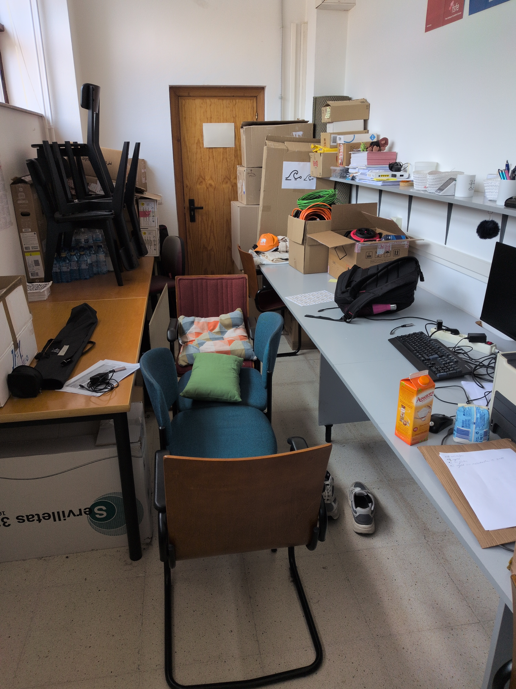

This summer I was very lucky to attend and help organize
[GUADEC 2026](https://events.gnome.org/event/306/), an annual conference about
GNOME. This is because this year it took place in A Coruña, the city where I'm
studying my bachelor's degree.

This could happen because [GPUL](https://gpul.org), a Linux User Group in my
faculty, of which I'm a part of, offered to host the event in our city and,
somehow, we ended up getting it!! 🥳

## My experience as an attendee

My lack of proper sleep and the side quests I had to do during the event
prevented me from attending many of the talks or BoFs, but I did enjoy lunch and
dinner with other members of the community, and got to meet very nice and
interesting people.

## My experience as an organizer

I really enjoyed helping organize the event, and the wholesomeness of the other
members of the organizing team is a big reason for it ❤️.

I mostly took care of hiring the AV Company, but I also got to run around the
venue with Iago placing signs and carry 5-6 pizzas on my lap, among other
things.

This was also possible for me because GNOME sponsored my stay in A Coruña, since
I don't live there during summer and it was pretty expensive to come and go each
day of the conference. So thanks to the GNOME Foundation for sponsoring me!!.
You can see [here](https://handbook.gnome.org/events/travel.html) the details of
the Travel Sponsorship Program.

, Victor, Deepesha, Anisa")

It truly was an unforgettable and very fullfilling experience, thank you again to everyone who made that possible.
