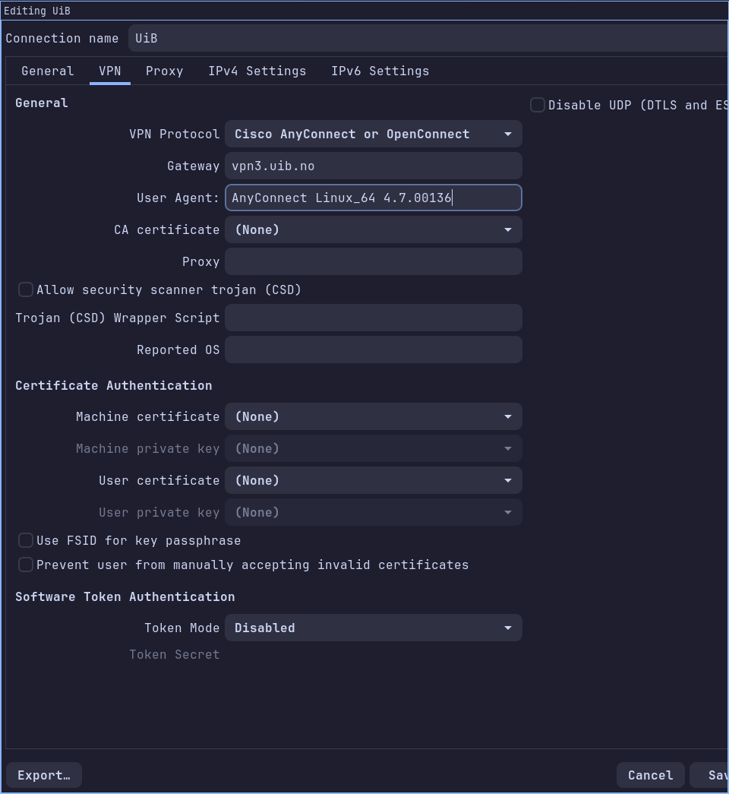

> [!NOTE] TLDR
>
> - Gateway: `vpn3.uib.no`
> - User Agent: `AnyConnect Linux_64 4.7.00136`

I just moved to Bergen for my Erasmus stay during the whole 2026/27 academic
year, and was dissapointed (but not surprised) that they used Cisco's AnyConnect
VPN here. I had no other choice than using it, because it is needed to access
the virtual campuse (Mitt UiB) and other important things. But at least I should
be able to avoid the official, propietary, client (but at
least the Linux version does exist, atlhough I would have to get creative for it to work on NixOS).

So, this isn't complicated at all, but I wanted to make this post so I don't forget
if I change laptop and also to write the paragraph above crying a little about the
situation (and don't get me started on the whole Microsoft ecosystem on almost
every university around the globe). I also hope this can help someone along the way.

There are already tutorials out there
([Sergey Budaev's](https://budaev.info/how-to-use-open-source-openconnect-for-uib-vpn.html),
[Tim Harek's](https://timharek.no/blog/uib-vpn-without-cisco/)), but it seems
that the **User Agent** is now checked, just set it to
`AnyConnect Linux_64 4.7.00136` and that should be it. So:

## Install OpenConnect

I'm using [OpenConnect](https://www.infradead.org/openconnect/) for this, which
you've probably already heard of. Just install it, and probably the integration
with NetworkManager (if it is a separate package in your distro) will be useful
too 😉.

## Connect !

Just create a new VPN Connection in your NetworkManager GUI and set:

- VPN Protocol: `Cisco AnyConnect`
- Gateway: `vpn3.uib.no`
- User Agent: `AnyConnect Linux_64 4.7.00136`

The clue that the User Agent is checked is from
[this thread in the Arch Linux Forums](https://bbs.archlinux.org/viewtopic.php?id=277082)

Now Save, Connect, sign in using your UiB Microsoft account and that **should**
be it 👍.
