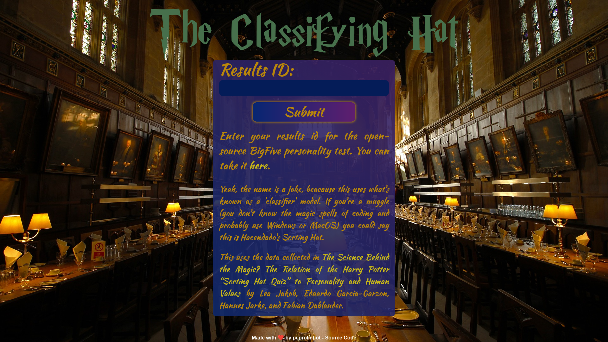



Discover to which Hogwart's house you belong with the help of a magical machine
learning model, which should provide a more scientifically accurate result than
your typical test.

You can find an instance hosted by myself on
[clashat.peprolinbot.com](https://clashat.peprolinbot.com).

This uses the data collected in
[The Science Behind the Magic? The Relation of
the Harry Potter “Sorting Hat Quiz” to Personality and Human Values](https://online.ucpress.edu/collabra/article/5/1/31/113037/The-Science-Behind-the-Magic-The-Relation-of-the)
by Lea Jakob, Eduardo Garcia-Garzon, Hannes Jarke, and Fabian Dablander.

> [!WARNING] Disclaimer (just in case)
>
> This project is not endorsed by, directly affiliated with, maintained by,
> sponsored by or in any way officially related with Wizarding World, Warner
> Bros, J. K. Rowling or any of the companies and individuals involved in the
> Harry Potter franchise.

## Used technologies

The web uses [Django](https://www.djangoproject.com/), and the model itself (a
simple
[Gaussian Naive Bayes Classifier](https://www.geeksforgeeks.org/machine-learning/gaussian-naive-bayes/))
works on [scikit-learn](https://scikit-learn.org/stable/index.html).

It also includes a simple scraper for
[bigfive-test.com](https://bigfive-test.com/), which was made using
[Beautiful Soup](https://www.crummy.com/software/BeautifulSoup/)

Also, the whole application is [Dockerized](https://docker.com) and runs on
[Nginx](https://nginx.org/) and [Gunicorn](https://gunicorn.org/)
