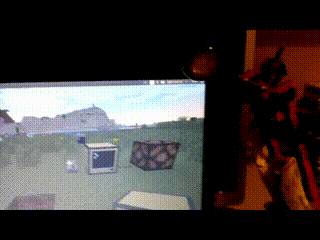
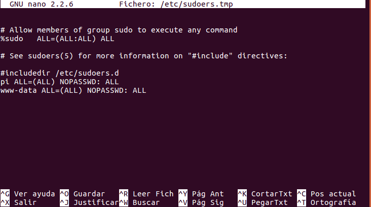
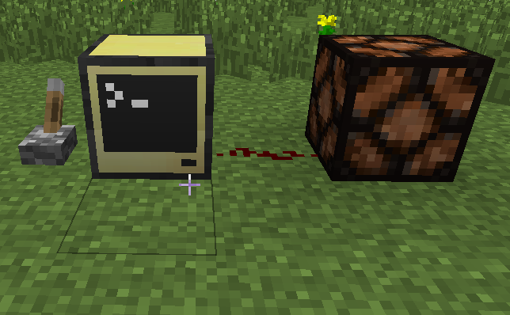

## Preamble

This is a very old tutorial I did **when I was 11** (so don't judge me),
explaining how I used ComputerCraft to control a lamp connected to a relay in my
Raspberry Pi. I just wanted to post it here for archival purposes and because I
think it's funny. I've mostly just copy pasted the whole
[original post](https://sites.google.com/view/pedrorminecraft/inicio/control-de-reles-raspberrypi),
with minor changes to the formatting, but the content is unchanged: i.e. it is
very bad and in spanish (kid level).



## Tutorial

¡Hola! Hoy os voy a enseñar a controlar los relés de vuestra Raspberry Pi con el
Minecraft.

Para conseguir esto haremos un código en Computercraft (lua) y otro en la
Raspberry Pi (php y bash).

Primero haremos el de la Raspberry Pi hace falta tener apache y php instalado ,
que la Raspberry corra raspbian y por supuesto unos relés conectados en el GPIO
17; el link de la pagina de RaspberryPi: www.raspberrypi.org. Para instalar
apache y php corremos esto en la línea de comandos (Menú --> Accesorios -->
LXTerminal o vía ssh), yo he usado ssh:

> [!WARNING] ¡NOTA IMPORTANTE!
>
> La contraseña por defecto es **_raspberry_**, es para cuando os diga
> `password :`
>
> Y no os preocupéis cuando no salga nada al escribir la contraseña, es por
> seguridad.

```
sudo apt-get update
sudo apt-get install apache2
sudo apt-get install php
```

Ahora vamos ha crear los scripts, para ello, ejecutamos:

```
cd /home/pi/
nano on
```

Pegamos esto (click derecho pegar):

```
sudo echo 17 > /sys/class/gpio/export

sudo echo out > /sys/class/gpio/gpio17/direction
```

Pulsamos "CTRL+X , s y INTRO" y ahora ejecutamos:

```
sudo chmod +x on
nano off
```

Pegamos esto (click derecho pegar):

```
sudo echo 0 > /sys/class/gpio/gpio17/value

sudo echo 17 > /sys/class/gpio/unexport
```

Pulsamos "CTRL+X , s y INTRO" y ahora ejecutamos:

```
sudo chmod +x off
cd /var/www/
sudo rm *
sudo mkdir mail
cd mail
nano mail.php
```

Pegamos esto (click derecho pegar):

```
<?php
$message = htmlspecialchars($_POST["message"]);
$output = shell_exec("$message");
print "$output"
?>
```

Pulsamos "CTRL+X , s y INTRO" y ahora ejecutamos:

```
sudo visudo
```

Y al final de todo (bajamos con flechas) pegamos esto:

```
www-data ALL=(ALL) NOPASSWD: ALL
```



Y pulsamos "CTRL+X , s y INTRO".

Ahora vamos con el programa de Computercraft; link de la página:
http://www.computercraft.info

Primero creamos un ordenador normal o avanzado de Computercraft de Minecraft.Y
ejecutamos esto:

```
pastebin get 3gqhbG5G luz
```

> [!TIP]- Nota del futuro
>
> Aunque no estaba en la página original, dejo aquí el contenido de
> [pastebin.com/3gqhbG5G](https://pastebin.com/3gqhbG5G):
>
> ```
> on = "sudo sh /home/pi/on"
> off = "sudo sh /home/pi/off"
> local old_s = redstone.getInput("left")
>
> while true do
>   s = redstone.getInput("left")
>   if s ~= old_s then
>     old_s = s
>     if s == true then
>       http.post(
>                       "http://raspberrypi/mail/mail.php",
>                       "message="..textutils.urlEncode(tostring(on))
>       )
>     else
>       http.post(    
>                       "http://raspberrypi/mail/mail.php",  
>                       "message="..textutils.urlEncode(tostring(off))
>       )
>     end
>     redstone.setOutput("right", s)
>   end
>   sleep(0.5)
> end
> ```

Ponemos una palanca a la izquierda y una lámpara de redstone a la derecha.



Entramos al ordenador (de Minecraft) y ejecutamos nuestro programa (luz),
simplemente escribiendo `luz`.

Salimos y al darle a la palanca, 5 segundos después se enciende la lámpara de
redstone y los relés.

> [!WARNING] ¡NOTA IMPORTANTE!
>
> Esto solo funciona si el ordenador con el que estáis jugando al Minecraft y la
> Raspberry Pi están en la misma red. A no ser que le abráis un puerto en
> vuestro router a la Raspberry, que no os lo recomiendo, ya que es inseguro,
> difícil y habría que cambiar el programa; pero por si queréis yo os dejo como
> hacerlo.

Pues bien para abrir un puerto en el router depende de vuestro router así que yo
solo os dire que busqueis en Google como hacerlo porque yo no voy a explicarlo
para todos los routers que existen, total que buscáis como hacerlo y abrirlo
para la raspberry en el puerto del servidor apache (normalmente 8080) entonces
cambiáis la linea del código de Computercraft (lua) en la que pone:

```
"http://raspberrypi/mail/mail.php",
```

En donde pone `raspberrypi` lo cambiáis por `la ip de vuestro router:8080`
pulsamos CTRL, Save (movemos con las flechas), CTRL, Exit. Y listo.
